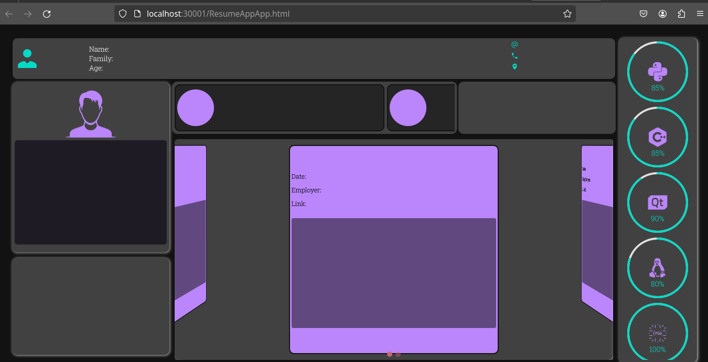

# ResumeApp         QTWebAssmbly
## Table of Contents
- [ResumeApp         QTWebAssmbly](#resumeapp---------qtwebassmbly)
  - [Table of Contents](#table-of-contents)
    - [Description](#description)
    - [Install](#install)
      - [FormatJson](#formatjson)
    - [UseProject](#useproject)
### Description
Qt for Webassembly lets you to run Qt applications on the web.

WebAssembly (abbreviated Wasm) is a binary instruction format intended to be executed in a virtual machine, for example in a web browser.

This program is for displaying resume in the form of a web application using Qt and QML. so that the data is in json file format


### Install

1. Installing Emscripten [link](https://doc.qt.io/qt-6/wasm.html)
2. git  clone
3. Qt 6.6.1
4. set path Emscription in  qtCreator
5. complate Resumne.json 
6. build

#### FormatJson

```json
{
    "about" :[
        {
            "information":[
              {
                "name" : "",
                "family" : "",
                "age" : "",
                "phone" : "" ,
                "location" : "",
                "about" : " "

              }
            ]

        }
    ],
    "jobs" :[
        {
            "job": "",
            "company" : "",
            "image" : ""
        },
        {
            "job": "",
            "company" : "",
            "image" : ""
        }
    ],
    "education" :[
        {
            "education" : "",
            "univesity" :  "",
            "Orientation" : "",
            "image" : ""
        },
        {
            "education" : "",
            "univesity" :  "",
            "Orientation" : "",
            "image" : ""

        }
    ],
}
```

### UseProject

output build  project:

1. resumeApp.html
2. qtloader.js
3. resumeApp.js
4. resume.wasm

runing python http.server in  directory app

